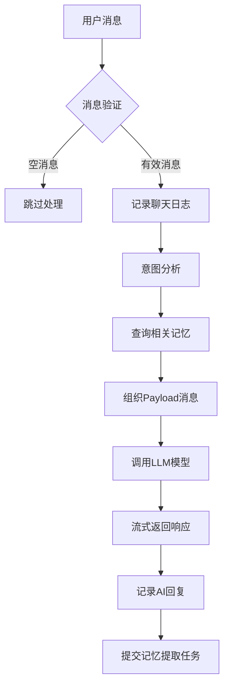

# API Server 模块

API Server 模块是 LingYi 项目的核心服务层，负责处理与本地大语言模型的通信和智能化处理。

## 文件结构

```
api_server/
├── llm_service.py         # LLM服务主模块
└── README.md              # 本文档
```

## 核心功能

### 1. LLM 通信服务 (`llm_service.py`)

该模块提供与本地大语言模型（通过 Ollama）的通信接口，支持 OpenAI API 标准格式。

#### 主要组件：

- **配置管理**: 自动加载系统配置，包括API密钥、模型URL、用户信息等
- **OpenAI客户端**: 初始化与本地Ollama服务的连接
- **系统提示词**: 从 `system/prompts/personality.txt` 加载AI人格设定

## 工作流程

### 消息处理流程



### 详细处理步骤

1. **消息预处理**
   - 验证消息内容是否为空
   - 记录用户输入到聊天日志
   - DEBUG模式下打印详细信息

2. **智能分析**
   - 调用意图分析器识别用户意图
   - 根据意图类型和具体任务进行分类

3. **记忆检索**
   - 基于最新消息和最近3条对话上下文
   - 从Neo4j图数据库查询相关历史记忆
   - 为模型提供个性化上下文

4. **消息组织**
   - 系统提示词（AI人格设定）
   - 记忆上下文（相关历史信息）
   - 对话历史（完整对话链）

5. **模型调用**
   - 使用OpenAI API格式调用本地Ollama
   - 支持流式响应，实时返回生成内容
   - 配置temperature=0.7确保回复的创造性

6. **后处理**
   - 记录AI回复到聊天日志
   - 将完整对话提交给记忆系统进行五元组提取
   - 异常处理和错误恢复

## 核心函数

### `chat_with_model(messages, on_response)`
主要的对话处理函数
- **输入**: 对话历史列表和响应回调函数
- **输出**: 完整的AI回复文本
- **功能**: 完整的消息处理流程

### `preload_model(timeout_sec)`
模型预加载函数
- **功能**: 启动时预热模型，确保服务可用
- **输出**: 模型加载状态（成功/失败）

### `get_recent_chat(messages, max_chars, min_messages)`
上下文提取函数
- **功能**: 从对话历史中提取最近的上下文信息
- **输出**: 格式化的对话上下文字符串

### `write_chat_log(sender, text)`
聊天记录函数
- **功能**: 将对话记录到日志文件
- **路径**: `brain/memory/logs/chat_logs/chat_logs_YYYY_MM_DD.txt`

### `call_model_sync(prompt, system_prompt)`
同步模型调用函数
- **功能**: 非流式的同步模型调用
- **用途**: 简单的模型测试和单次查询

## 依赖关系

### 内部依赖
- `system.config`: 系统配置管理
- `system.intent_analyzer`: 意图分析
- `brain.memory.quintuples_extractor`: 记忆提取
- `brain.memory.relevant_memory_search`: 记忆检索

### 外部依赖
- `openai`: OpenAI API客户端
- `datetime`: 时间处理
- `json`: JSON数据处理

## 配置要求

模块需要以下配置项（在 `config.json` 中）：
- `api.api_key`: API密钥
- `api.base_url`: Ollama服务地址
- `api.model`: 使用的模型名称
- `system.ai_name`: AI名称
- `ui.username`: 用户名称
- `system.debug`: 调试模式开关

## 日志系统

### 聊天日志
- **位置**: `brain/memory/logs/chat_logs/`
- **格式**: `HH:MM:SS <发送者> 消息内容`
- **文件名**: `chat_logs_YYYY_MM_DD.txt`

### 调试日志
- DEBUG模式下输出详细的处理信息
- 包含意图分析结果、记忆查询状态等

## 错误处理

- **连接异常**: 自动捕获并报告通信错误
- **模型异常**: 优雅处理模型调用失败
- **记忆异常**: 记忆系统故障不影响对话功能
- **日志异常**: 日志写入失败不中断主流程

## 性能优化

- **空消息检测**: 避免处理空白消息，节省资源
- **流式响应**: 实时返回生成内容，提升用户体验
- **异步记忆**: 记忆提取任务异步执行，不阻塞对话
- **上下文限制**: 智能选择对话上下文，控制token使用

## 使用示例

```python
from api_server.llm_service import chat_with_model, preload_model

# 预加载模型
if preload_model():
    print("模型加载成功")

# 处理对话
messages = [{"role": "user", "content": "你好"}]

def on_response(chunk):
    print(chunk, end="", flush=True)

reply = chat_with_model(messages, on_response)
print(f"完整回复: {reply}")
```

## 维护说明

- 定期清理 `__pycache__` 缓存文件
- 监控日志文件大小，必要时进行轮转
- 关注模型服务的可用性和响应时间
- 定期检查记忆系统的连接状态
